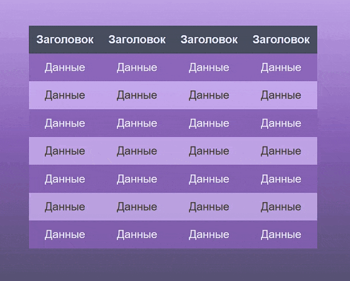

#Beautiful-frontend components and design solutions 
## Interesting web development design components that I implement in my free time
Hi. I am an aspiring frontend developer. This repository is my own storehouse of various web page design components that I found interesting and that I implemented. I will be happy if at least the idea and at most the code are useful in your development. All additional resources, such as images, are taken from open sources and used exclusively as part of the example.
# Here's what it looks like:
* ##[Beautiful-carousel](beautiful-carousel)
  * ###A beautiful carousel of movie posters. In your case, it can be any other carousel, for example, a list of popular products. The color scheme can be easily changed, in fact, 5 main combined colors are used, which you can adjust to the ones you need. A mobile version will be added later.

* ##[Beautiful-table](beautiful-table)
  * ###A beautiful table with cross-highlighting when hovering over its cell. The color scheme can be easily changed to suit your design. Perhaps a mobile version will be added later.

* ##[Beautiful-button](beautiful-button)
  * ###A beautiful button with a glitch effect. It can be used in bright designs with the appropriate style. The mobile version may be available later

* ##[Beautiful-list](beautiful-list)
  * ###A beautiful floating list. There is no special design, it can be customized by you. The main interesting feature is the departure of the list items at the time of scrolling by the user to the desired position on the site. The mobile version will be available later.

#You can also rate my other projects:
* ## [Web-calculator](https://github.com/B-S-B-Rabbit/B-S-B-Rabbit.github.io)